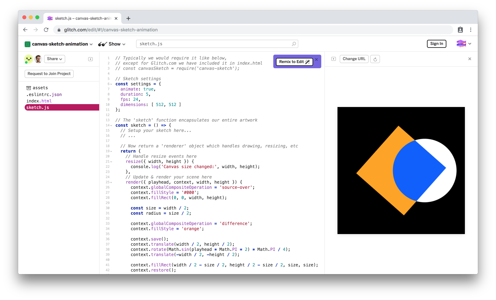

#### <sup>:closed_book: [workshop-webgl-glsl](../README.md) → Intro to `canvas-sketch`</sup>

---

# Intro to `canvas-sketch`

This is a quick refresher on [canvas-sketch](https://github.com/mattdesl/canvas-sketch).

## Contents

- [About](#About)

- [Quick Start](#quick-start)

- [Running Locally](#running-locally)

- [Hotkeys](#hotkeys)

- [Exporting MP4 and GIF](#exporting-mp4-and-gif)

  - [Frame Seuqneces](#frame-sequences)

  - [FFMPEG Export](#ffmpeg-export)

- [Utilities](#utilities)

- [Bundling to a Website](#bundling-to-a-website)

  - [Hosting](#hosting)

## About

For the purpose of the workshop, we'll be using a framework called [canvas-sketch](https://github.com/mattdesl/canvas-sketch) to scaffold our generative artworks and interactive projects.

The main benefits of `canvas-sketch`:

- Provides a consistent structure across all our demos and projects
- Enables `require()` statements in our frontend code to import libraries from npm
- Includes built-in support for GLSL files and `glslify` import statements
- Provides an easy way to export PNG for web or print, as well as MP4 and GIF files

## Quick Start

You can quickly jump into editing a basic `canvas-sketch` 2D demo here:

### ✨ [canvas-sketch-animation on Glitch.com](https://glitch.com/edit/#!/canvas-sketch-animation?path=sketch.js)



## Running Locally

Most of the benefits of `canvas-sketch` (MP4 export, `require()` statements, etc) are only usable when we run the CLI tool locally.

You can install it with npm:

```sh
npm install canvas-sketch-cli -g
```

> :bulb: Notice the `-cli` part! This means we want to install the CLI tool, not just the JavaScript library.

Then, go into a new directory:

```sh
mkdir genart-workshop
cd genart-workshop
```

And scaffold out our first artwork with the `three` template:

```sh
canvas-sketch src/sketch.js --new --template=three
```

Now open <a href='http://localhost:9966/' target="_blank">http://localhost:9966/</a> and start to edit `src/sketch.js`, and the browser should live reload.

## Hotkeys

Once the tool is running in the browser and with the canvas in focus, you can use these hotkeys:

- Export a Single Frame to *Downloads* folder:

  - <kbd>Cmd</kbd>+<kbd>S</kbd> or <kbd>Ctrl</kbd>+<kbd>S</kbd>

- Toggle Exporting a Frame Sequence to *Downloads* folder:

  - <kbd>Cmd</kbd>+<kbd>Shift</kbd>+<kbd>S</kbd> or <kbd>Ctrl</kbd>+<kbd>Shift</kbd>+<kbd>S</kbd>

## Exporting MP4 and GIF

### Frame Sequences

You can use an output directory so that you don't pollute your Downloads folder, like so:

```sh
canvas-sketch my-sketch.js --output=tmp
```

Now you can hit `Cmd + Shit + S` to export into the `tmp/` folder, relative to your sketch directory.

### FFMPEG Export

If you haven't got `ffmpeg` installed already, you can install this utility module globally:

```sh
npm install @ffmpeg-installer/ffmpeg --global
```

Then, you should be able to use the `--stream` option to stream directly into MP4 files:

```sh
canvas-sketch my-sketch.js --stream
```

Using <kbd>Cmd/Ctrl</kbd>+<kbd>Shift</kbd>+<kbd>S</kbd> will export an MP4 file in your Downloads folder once all frames are rendered.

You can export GIF like so:

```sh
canvas-sketch my-sketch.js --stream=gif
```

Another tip: if you render at `[ 1024, 1024 ]` dimensions, but scale down the GIF while encoding, you might end up with more crisp lines:

```sh
canvas-sketch my-sketch.js --stream [ gif --scale=512:-1 ]
```

## Utilities

The framework includes some utilities for math, color parsing, randomness, and other functions commonly used in creative coding. You can see it here:

- [canvas-sketch-util](https://github.com/mattdesl/canvas-sketch-util)

To install:

```sh
npm install canvas-sketch-util
```

Then in your project:

```js
const { lerp } = require('canvas-sketch-util/math');
const Random = require('canvas-sketch-util/random');
```

## Bundling to a Website

If you'd like to publish your artwork or interactive piece onto the web, here's how you can do it.

First, you have to bundle your sketch as a static website.

You can do this with the `--build` flag:

```sh
canvas-sketch mysketch.js --build --name=index
```

This will generate a JS and HTML file in `./public/`, and the `--name` flag will rename the output files to `index.html` and `index.js`.

### Hosting

You can use one of the following for free static hosting:

- [surge.sh](https://surge.sh/)
- [Netlify](https://www.netlify.com)
- [GitHub Pages](https://pages.github.com)
- [Neocities](https://neocities.org)

I suggest `surge`, which looks like this in your sketch repo:

```sh
# first install the tool locally
npm install surge --save-dev

# now you cn run it to upload the files
npx surge -p public -d mysketch.surge.sh
```

Where `-d` specifies the domain, so you can use `some-custom-url.surge.sh` and change it to your liking.

## 

#### <sup>[← Back to README](../README.md)