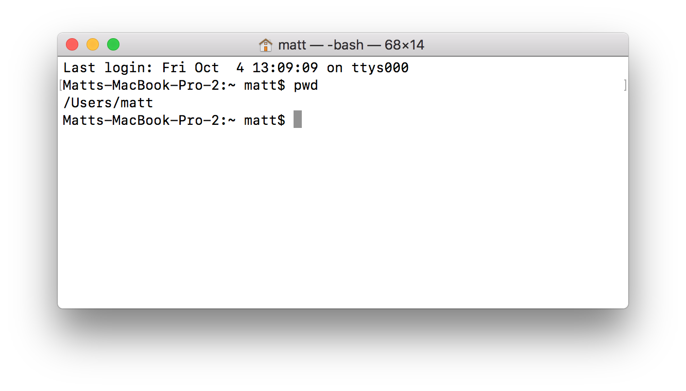
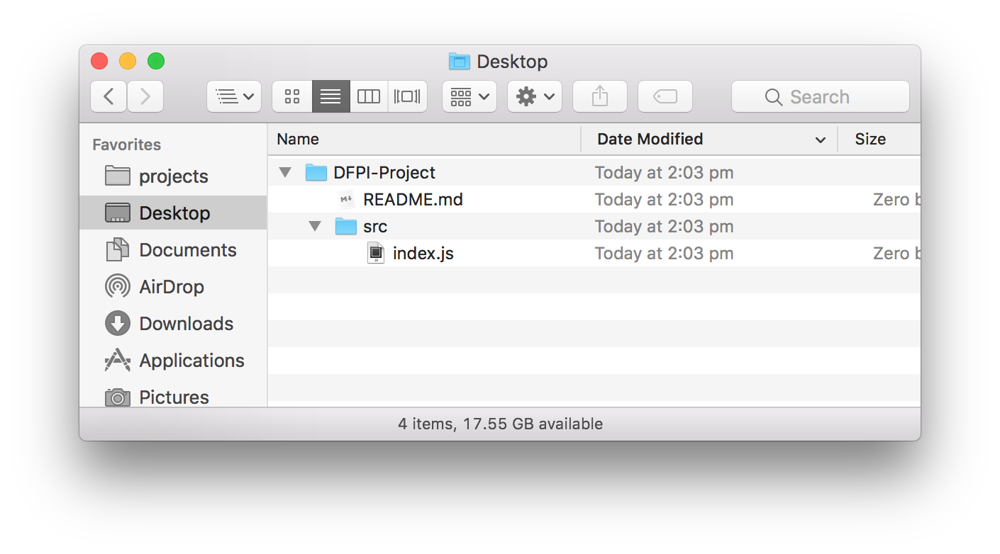

#### <sup>:closed_book: [workshop-webgl-glsl](../README.md) → Intro to the Command-Line</sup>

---

# Intro to the Command-Line

The *Terminal* or *Command-Line Interface* (CLI) is a way of interacting with a computer without a graphical user-interface. Instead, we type commands and use our keyboard to navigate files, execute programs, and fetch data from the web.

## Contents

- [Quick Start](#quick-start)
- [Opening the Terminal](#opening)
- [Running Commands](#running)
- [Navigating the File System](#navigating)
- [Making Files and Folders](#making-files-and-folders)

## Quick Start

Already a little familiar with the terminal and just want a refresh?

- `pwd` — print current working directory
- `cd` — change current directory
- `ls` — list files in current directory
- `mkdir` — make a new folder, e.g. `mkdir MyFolder/`
- `touch` — create a new empty file, e.g. `touch index.js`
- `pbpaste > myfile.txt` — paste clipboard contents into a file (overwriting!)
- `pbpaste >> myfile.txt` — paste clipboard contents into a file (appending)
- `clear` (macOS) or `cls` (Windows) — clear the terminal
- `open .` (macOS Only) — on macOS, open the current working directory in Finder
- <kbd>Ctrl</kbd>+<kbd>C</kbd> — kill current process, e.g. quick a CLI tool
- <kbd>Tab</kbd> — auto-complete the current command or path
- <kbd>Up</kbd> and <kbd>Down</kbd> — navigate previously run commands
- <kbd>⌘</kbd>+<kbd>T</kbd> (macOS) or <kbd>Ctrl</kbd>+<kbd>T</kbd> (Windows) — open a new terminal tab in a different process

<a name="opening"></a>

## Opening the Terminal

### macOS 

If you are on macOS, there's no need to install anything. You just need to open `Terminal.app` which comes with your system.

Choose one of the following to open the app:

  1. Pushing <kbd>⌘</kbd> + <kbd>Space</kbd> to open Spotlight, and then searching for *Terminal.app* and hitting <kbd>Enter</kbd> to open.

  2. Open **Finder**, go to your **Applications** folder, then open the **Utilities** folder and look for *Terminal.app*. Double-click it to open.

### Windows

If you are on Windows, we have to install an emulator so that we can enter macOS-style commands. I recommend installing [cmder](https://cmder.net). Download the ZIP and extract the contents to your **Program Files** or some other location on your computer.

Once installed, double-click the **cmder.exe** file to open the terminal.

<a name="running"></a>

## Running Commands

To run a command, you can type it into the terminal window and hit <kbd>Enter</kbd>. You can use the <kbd>Up</kbd> and <kbd>Down</kbd> arrow keys to navigate previously run commands.

Try typing in the `pwd` command and then hitting <kbd>Enter</kbd>:



The `pwd` command will print the current path of the terminal process, which might be different depending on your system.

- On *macOS* it may appear as `/Users/YOUR_USER_NAME`
- On *Windows* it may apper as `C:\Users\YOUR_USER_NAME`

<a name="navigating"></a>

## Navigating the File System

The first thing you should learn to do is navigate around different folders on your system. 

### `cd` — Change Directory

We will use the `cd` command (change directory).

#### Absolute Paths

You can navigate to a new folder by specifying an absolute file path:

```sh
# On macOS
cd /Users/YOUR_USER_NAME/Desktop

# On windows
cd C:\Users\YOUR_USER_NAME\Desktop
```

> :bulb: Lines beginning with `#` are treated as comments and will do nothing.

Now, all future commands will be executed from within this new folder.

You can again test to see if the command worked by using `pwd` to get the current file path.

#### Relative Paths

Once you navigate to a folder like your Desktop, you can use relative paths to go in and out of folders. Imagine you have a folder on your desktop like so:



You can do the following to move into that folder:

```sh
# Move into the folder
cd DFPI-Project/
```

Or, once you've moved into the folder, you can move back out of it, by *going up* one directory:

```sh
# Move up one directory
cd ../
```

The final `/` slash is optional. Here are some other examples:

```sh
# Going deep into folders
cd SomeFolder/NestedFolder/OneMore

# Going up multiple times and then into another folder
cd ../../SomeFolder
```

### :warning: Gotcha: Spaces!

If you file path has spaces in it, you should encapsulate the entire path with double quotes like so:

```sh
cd "My Folder/src/foo"
```

### `ls` — List Files

To list files in the current directory, use `ls`.

```sh
ls
```


## Making Files and Folders

### `mkdir` — Create a new directory

You can use the `mkdir` command to create a new folder in the working directory.

```sh
mkdir MyFolder/
```

### `touch` — Create a new file

You can use the `touch` command to create a new empty file in your working directory:

```sh
# this creates an empty JavaScript file called 'index.js'
touch index.js
```

If the file already exists, this will do nothing.

### `pbpaste` — Paste Clipboard Contents

You can use `pbpaste` like so to paste the clipboard contents into a file (overwriting the file!).

```sh
# overwrite index.js with clipboard contents
pbpaste > index.js
```

If you'd rather paste the contents to the end of the file without overwriting the entire thing, you can use `>>` which is for appending:

```sh
# append index.js with clipboard contents
pbpaste >> index.js
```

## 

#### <sup>[← Back to README](../README.md)