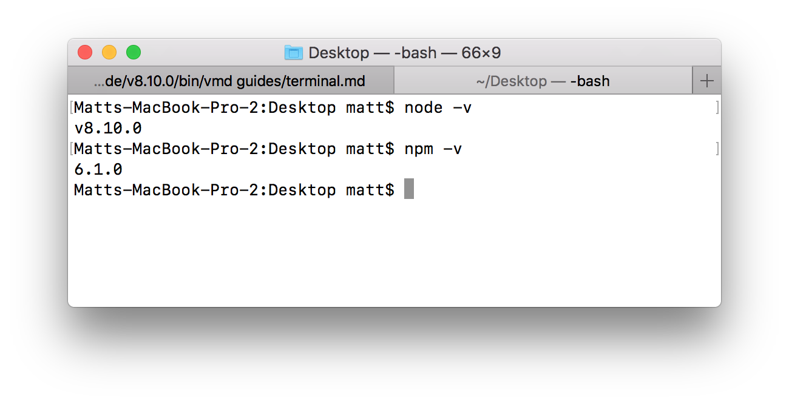
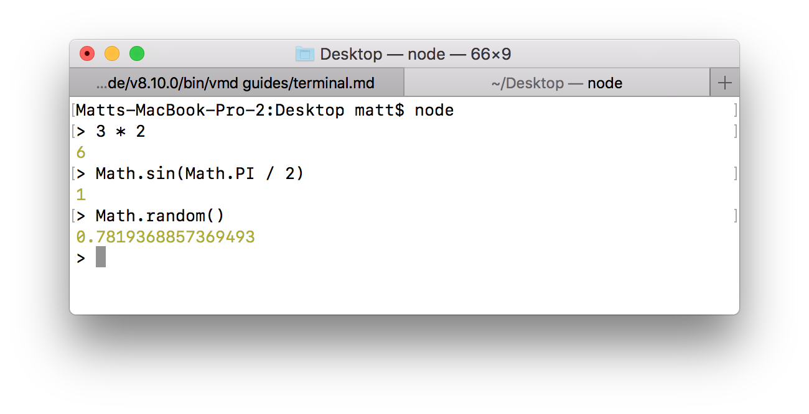
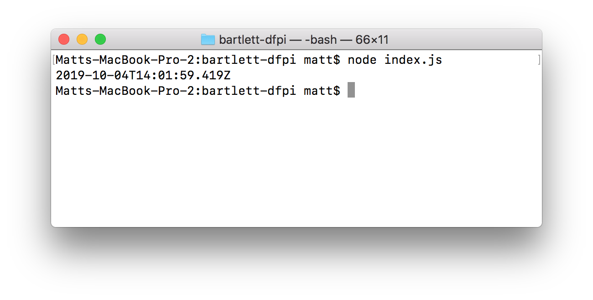
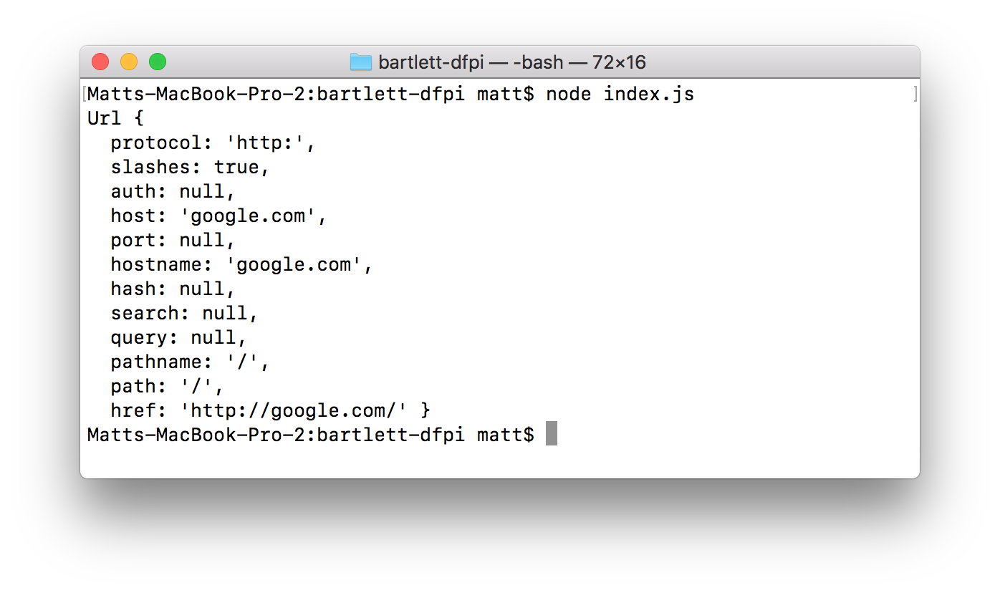
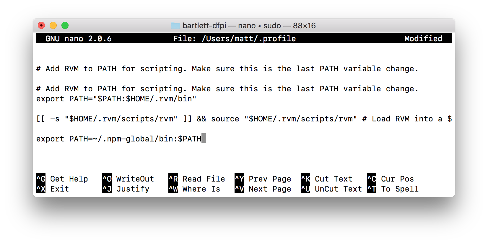

#### <sup>:closed_book: [workshop-webgl-glsl](../README.md) → Intro to Node.js and npm</sup>

---

# Intro to Node.js and npm

[Node.js](https://nodejs.org/en/) is a software that allows us to run JavaScript files and programs from the terminal.

[npm](https://www.npmjs.com) is what we will use to download JavaScript "modules" (pieces of code) and command-line tools.

## Contents

- [Installation](#installation)
- [Node REPL](#node-repl)
- [Running JavaScript Files with Node.js](#files)
- [Modules and `require()`](#modules)
- [Installing Modules from npm](#installing-modules-from-npm)
- [Installing Applications from npm](#installing-applications-from-npm)
- [Troubleshooting `EACCESS` Errors](#eaccess)
- [Code Snippets](#code-snippets)

## Installation

Install the latest version of Node.js (v10 is recommended, v12 is also fine) from [their website](https://nodejs.org/en/). This also comes bundled with a recent version of `npm`.

After installation, you should be able to open your Terminal window (see the [Command Line](./command-line.md)) and run the following:

```sh
# print node version
node -v

# print npm version
npm -v
```



If both commands work and give you a number, then it means the tools installed correctly.

## Node REPL

A handy thing is to enter the Node REPL (Read, Eval, Print Loop) which allows us to run JavaScript from within our Terminal window.

Just run the `node` command and it will enter the REPL:

```sh
node
```

Now you can enter JavaScript expressions like `2 * 3`,  `const a = 3`, `console.log("hello")`, and so on.



To quit the REPL, enter <kbd>Ctrl</kbd>+<kbd>C</kbd>.

> :bulb: Since we are in a "Pure JavaScript" environment without P5.js, we don't have access to its utilities like `sin()`, `PI`, `random()`, and so on. However, many of these exist natively in JavaScript in [the Math object](https://developer.mozilla.org/en-US/docs/Web/JavaScript/Reference/Global_Objects/Math).

<a name="files"></a>

## Running JavaScript Files with Node.js

Next, let's create a new JavaScript file that prints the current time.

First, create an empty directory and then an empty JavaScript file:

```sh
# create an empty directory
mkdir MyProject

# go into the directory
cd MyProject

# create an empty file within it
touch index.js
```

Now open the file in a text or code editor and paste in the following:

```js
console.log(new Date());
```

Now, when we run `node index.js`, it will execute the script as if it were a command-line application.

```sh
node index.js
```

Result:



<a name="modules"></a>

## Modules and `require()`

Unlike in the browser, in Node.js we can import "modules" of code into our programs. These are small pieces of code that other people have written, and using them generally makes our lives easier.

Let's do something simple and require the `'url'` module, which is built-in to Node.js and provides utilities for dealing with URL strings.

We use the `require(moduleName)` function to import modules. Let's update our `index.js` with the following:

```js
const URL = require('url');

const parts = URL.parse('http://google.com/');
console.log(parts);
```

Now when we re-run our program with `node index.js`, it will result in the following:



Another commonly used built-in module is [fs](https://nodejs.org/api/fs.html) which gives us the ability to read and write files in JavaScript. Here is an example:

```js
const fs = require('fs');

// Assuming myfile.txt exists in the working directory
const txt = fs.readFileSync('myfile.txt').toString();

// Print the file, maybe do something with it...
console.log(txt);
```

## Installing Modules from npm

Things start to get interesting when you install and use modules from [npm](https://www.npmjs.com). There are over a million packages on npm, and hundreds of thousands of really useful and fun pieces of code.

### Step 1: Creating a `package.json`

Before we can use modules from npm, we have to make sure we have a `package.json` file in our folder. This file holds all the modules we've installed.

If you are in the same empty folder that you created `index.js`, then you can run the following to generate a simple `package.json` file:

```sh
npm init -y
```

You only need to do this the first time you create a new project.

### Step 2: Installing Modules Locally

Now that you have a `package.json` file, you can install modules from npm.

Here is a fun one: [superheroes](https://github.com/sindresorhus/superheroes) is a module that gives you a list of ~1800 superhero names like `"Spider-Man"` and `"T'Challa"`.

To install it, we will use npm in our terminal, in the same folder as before:

```sh
npm install superheroes
```

This will update `package.json` automatically.

Now we can `require('superheroes')` in the REPL or in a JavaScript file. Here's a simple program that pits two random superheroes against each other:

```js
const superheroes = require('superheroes');

const a = superheroes.random();
const b = superheroes.random();
console.log(a, 'vs.', b);
```

Each module might be used in a slightly different way, typically if you consult the module page on GitHub or npm it will include code examples and documentation.

There are modules on almost every topic, here's a few cool ones:

- [twitter](https://www.npmjs.com/package/twitter) — Node.js access to the Twitter API
- [philips-hue](https://www.npmjs.com/package/philips-hue) — Connect with Philips Hue bulbs via Node.js
- [johnny-five](https://www.npmjs.com/package/johnny-five) — Connect with hardware interfaces, LEDs, robots and more with Node.js
- [pdfkit](https://www.npmjs.com/package/pdfkit) — Generate PDF files in Node.js
- [brain.js](https://www.npmjs.com/package/brain.js) — Machine learning in JavaScript
- [jimp](https://www.npmjs.com/package/jimp) — image manipulation with Node.js
- [neat-csv](https://www.npmjs.com/package/neat-csv) — parse CSV files with Node.js
- [franc](https://github.com/wooorm/franc) — detect the language of a given string

## Installing Applications from npm

Not only can you install small libraries of code from npm, but you can also use it to install command-line applications.

To install a CLI application, we use the `--global` flag when installing. You can run this command from any folder, and you don't need a `package.json` file for global applications.

For example, let's install [serve](https://github.com/zeit/serve) now, which will allow us to develop HTML websites without the internet:

```sh
npm install serve --global
```

> :bulb: If you run into EACCESS errors, see the [next section](#eaccess) 

After its installed, we should be able to run `serve` from the command-line. Use a dot `.` as the path, which means "current directory."

```sh
serve .
```

Now try opening [http://localhost:5000/](http://localhost:5000/) (or whatever URL is printed) in your browser to see the result. If you add an `index.html` in your folder and then reload the browser, you can start to develop a simple website.

Here's an example `index.html` file you can use:

```html
<p>Hello <b>world!</b></p>
```

<a name="eaccess"></a>

## Troubleshooting `EACCESS` Errors

If you get an `EACCES` error when installing something with `--global`, you can try one of the following ways to fix this:

### (Quick Hack) Use `sudo`

A quick way to fix is with `sudo`, but this is generally not recommended as it can be less secure/safe! :warning:

```sh
sudo npm install serve --global
```

Follow the steps below for a more secure approach to globally installing CLI tools from npm.

### Reinstall Node.js

Sometimes reinstalling [Node.js](https://nodejs.org/en/) (perhaps a different version than you last tried) will resolve the issue. After installing, quit your terminal and reboot your computer.

Then try installing a global module again like so:

```sh
npm install serve --global
```

### (macOS Only) Change Default Directory

If the above doesn't fix it, you can try the following on macOS.

Run each of these commands in your terminal window one after another:

```sh
mkdir ~/.npm-global
```

Then:

```sh
npm config set prefix '~/.npm-global'
```

Now we need to add a line to a file called `~/.profile`. First make sure the file exists:

```sh
touch ~/.profile
```

Now we will append a line to it. First, copy the following line exactly with <kbd>⌘</kbd>+<kbd>C</kbd>:

```sh
export PATH=~/.npm-global/bin:$PATH
```

Now, we will edit the file via terminal, run the following:

```sh
sudo nano ~/.profile
```

This will prompt for your computer's password, type it in and hit <kbd>Enter</kbd>.

Then it will open the file in the Terminal window. The file may already have some text in it, so we will scroll down by pushing the <kbd>Down</kbd> arrow key until you cannot scroll down any more.

Now hit <kbd>⌘</kbd>+<kbd>V</kbd> to paste the line we copied earlier line into the file.



Then hit <kbd>Ctrl</kbd>+<kbd>O</kbd> to save the file, and then <kbd>Enter</kbd> to confirm.

Then hit <kbd>Ctrl</kbd>+<kbd>X</kbd> to exit the text editor.

Finally, we can run the following terminal command:

```sh
source ~/.profile
```

And we should be able to re-install npm modules globally:

```sh
npm install serve --global
```

### Node Version Manager

If you still can't get it to work, you may need to install a Node Version Manager:

- **macOS** – [nvm](https://github.com/nvm-sh/nvm)
- **Windows** – [nvm-windows](https://github.com/coreybutler/nvm-windows/releases) (download and unzip `nvm-setup.zip`)

Once its installed, quit and re-open your terminal and you should be able to run it like so:

```sh
nvm --version
```

Now run the following to install latest Node.js:

```sh
nvm install stable
```

And fianlly we alias it so that it persists every time we close and reopen our terminal:

```sh
nvm alias default stable
```

Now try re-installing your CLI app globally from npm:

```sh
npm install serve --global
```

## 

#### <sup>[← Back to README](../README.md)